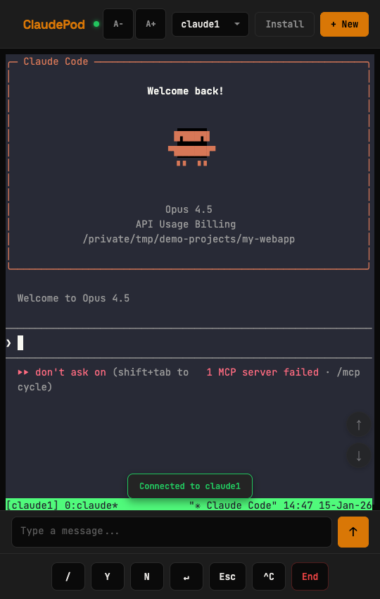
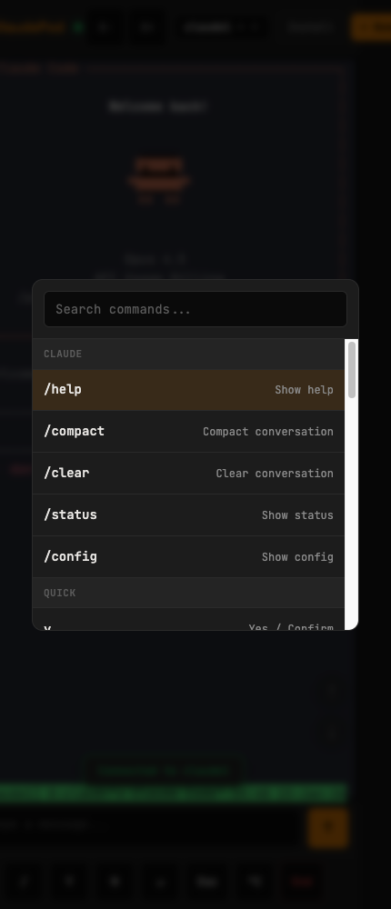
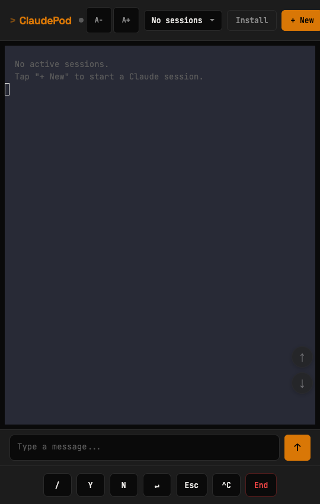
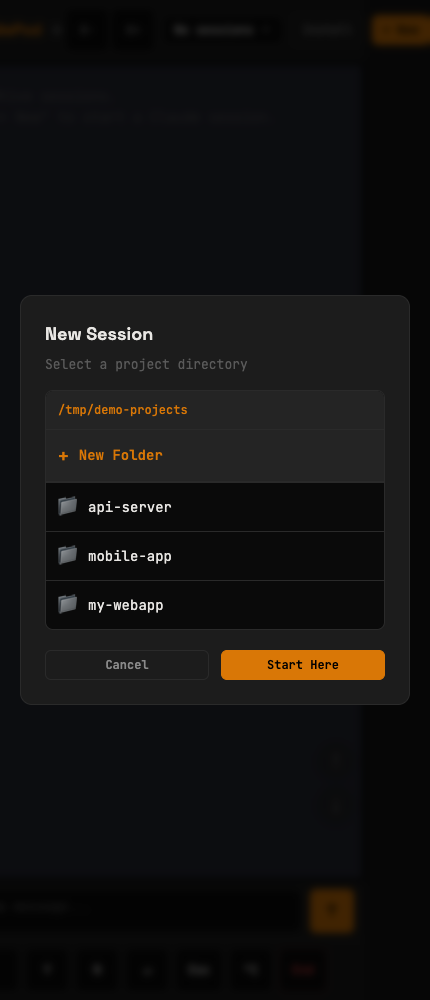

# ClaudePod

A mobile-first PWA for remotely monitoring and interacting with [Claude Code](https://github.com/anthropics/claude-code) sessions. Access your Claude sessions from your phone while away from your desk.

  

<p align="center">
  
  
</p>

## Why ClaudePod?

Claude Code runs long tasks that often pause for confirmation. ClaudePod lets you:

- **Monitor sessions from your phone** via Tailscale while away from your desk
- **Get push notifications** when Claude needs your input
- **Quickly respond** with Y/N/Enter without typing
- **Switch between multiple** Claude sessions seamlessly

---

## Quick Start

### Prerequisites

- **macOS** with **Node.js 18+**
- **tmux** - `brew install tmux`
- **[Tailscale](https://tailscale.com)** for remote access (free for personal use)
- *(Optional)* **[Pushover](https://pushover.net)** account for push notifications ($5 one-time)

### Installation

```bash
# Clone the repo
git clone https://github.com/tomstetson/claudepod.git
cd claudepod

# Install dependencies
npm install

# Start the server
npm start
```

### Connect from Your Phone

1. Open `http://localhost:3000` on your Mac to verify it works
2. Get your Tailscale IP: `tailscale ip -4`
3. On your phone, open `http://<tailscale-ip>:3000`
4. Tap **"Install"** or add to home screen for the full PWA experience

---

## Features

### Mobile-First Design

<p align="center">
  
  
</p>

- **44px touch targets** following Apple Human Interface Guidelines
- **iOS keyboard handling** with visualViewport API
- **Swipe gestures** to switch between sessions
- **Haptic feedback** on interactions
- **PWA installable** on home screen

### Terminal Emulator

- Full **xterm.js** terminal with 256-color support
- **5 built-in themes**: Default, Dracula, Nord, Solarized, Monokai
- **Font size controls** (A- / A+)
- **Search terminal output** (Cmd/Ctrl+F)
- **Copy selection** and **export session** to file

### Quick Actions

Bottom bar buttons for common Claude interactions:

| Button | Action |
|--------|--------|
| `/` | Open command palette |
| `Y` | Send "y" (confirm) |
| `N` | Send "n" (decline) |
| `↵` | Send Enter |
| `Esc` | Send Escape |
| `^C` | Send Ctrl+C (interrupt) |
| `End` | Kill session |

### Command Palette

Press `/` or `Cmd+P` to open the command palette with:

- **Claude commands**: /help, /compact, /clear, /status, /config
- **Git shortcuts**: status, diff, log
- **Dev shortcuts**: npm test, npm run build, ls
- **Session management**: rename, search, mute notifications, export/import
- **View controls**: clear display, scroll, change theme

### Push Notifications

Get notified on your phone when Claude needs input:

- **Pushover integration** for reliable push notifications
- **Smart detection** of 30+ Claude prompt patterns
- **Debouncing** to prevent notification spam
- **Per-session muting** for noisy sessions
- Only notifies when you're **not actively viewing**

---

## Configuration

Create a `.env` file in the project root (optional):

```bash
# Directory shown when creating new sessions (defaults to $HOME)
CLAUDEPOD_PROJECTS_DIR=/path/to/your/projects

# Server port (default: 3000)
PORT=3000

# Push notifications via Pushover (optional)
# Sign up at https://pushover.net and create an application
PUSHOVER_APP_TOKEN=your_app_token
PUSHOVER_USER_KEY=your_user_key

# Custom tmux path (default: /opt/homebrew/bin/tmux)
# Change if tmux is installed elsewhere (e.g., /usr/local/bin/tmux)
TMUX_PATH=/opt/homebrew/bin/tmux
```

---

## Usage Guide

### Creating a New Session

1. Tap **+ New** in the header
2. Browse to select a project directory
3. Tap **Start Here** to launch Claude Code in that directory

### Managing Sessions

- **Switch sessions**: Use the dropdown in the header or swipe left/right
- **Rename session**: Open command palette → "Rename"
- **End session**: Tap the red "End" button
- **Mute notifications**: Open command palette → "🔕 Mute"

### Keyboard Shortcuts (Desktop)

| Shortcut | Action |
|----------|--------|
| `Cmd/Ctrl + P` | Command palette |
| `Cmd/Ctrl + K` | Clear terminal |
| `Cmd/Ctrl + F` | Search terminal |
| `Cmd/Ctrl + T` | Cycle theme |
| `Cmd/Ctrl + S` | Export session |
| `Cmd/Ctrl + O` | Import file |
| `Cmd/Ctrl + Shift + N` | New session |
| `Cmd/Ctrl + Shift + K` | Kill session |

---

## Architecture

```
Your Mac                              Your Phone
┌─────────────────────────────┐      ┌──────────────────┐
│  tmux sessions              │      │                  │
│   ├─ claude1 (claude)       │◄────►│   ClaudePod PWA  │
│   ├─ claude2 (claude)       │  WS  │                  │
│   └─ claude3 (claude)       │      └──────────────────┘
│            ▲                │              │
│            │                │              │
│   ClaudePod Server          │◄─────────────┘
│   (Express + node-pty)      │         Tailscale
│   localhost:3000            │
└─────────────────────────────┘
```

**How it works:**

1. ClaudePod creates **tmux sessions** running Claude Code
2. **node-pty** provides PTY access to each session
3. **WebSocket** streams terminal I/O to the browser in real-time
4. **xterm.js** renders the terminal in the browser
5. **Tailscale** provides secure remote access from your phone

---

## Security

ClaudePod is designed for **trusted local/Tailscale networks**:

- **Helmet.js** security headers
- **Rate limiting** on API endpoints (100 req/15min)
- **WebSocket origin validation** (localhost + private IPs + Tailscale)
- **Path traversal protection** on directory browsing
- **No secrets in codebase** (all config via env vars)

> ⚠️ **Warning**: Do not expose ClaudePod directly to the internet. Use Tailscale or another VPN for remote access.

---

## Development

```bash
# Run with auto-reload
npm run dev

# Run tests
npm test

# Run all tests including PTY integration
npm run test:all

# Run with process manager (auto-restart on crash)
npm run start:managed
```

---

## Troubleshooting

### "No sessions" showing

1. Ensure tmux is installed: `which tmux`
2. Check if tmux server is running: `tmux ls`
3. Verify `TMUX_PATH` in `.env` matches your installation

### Can't connect from phone

1. Verify Tailscale is connected on both devices
2. Check firewall allows port 3000
3. Get your Tailscale IP: `tailscale ip -4`
4. Try accessing directly: `http://<ip>:3000`

### node-pty build errors

1. Install Xcode CLI tools: `xcode-select --install`
2. Clear cache and reinstall: `rm -rf node_modules && npm install`

### WebSocket disconnects frequently

This is normal behavior - the app auto-reconnects. If persistent:
1. Check network stability
2. Ensure the server process is running

---

## License

MIT

## Acknowledgments

- [xterm.js](https://xtermjs.org/) - Terminal emulator
- [Hammer.js](https://hammerjs.github.io/) - Touch gestures
- [Pushover](https://pushover.net/) - Push notifications
- [node-pty](https://github.com/microsoft/node-pty) - PTY bindings

---

Made with ❤️ by Tom
